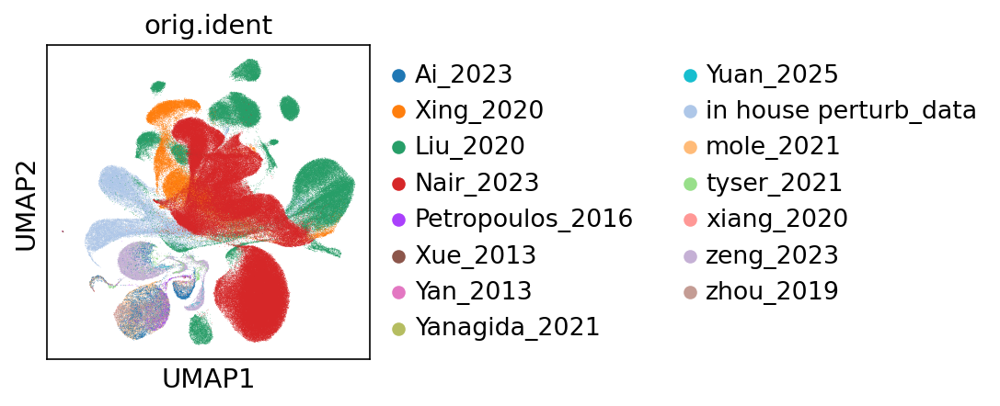
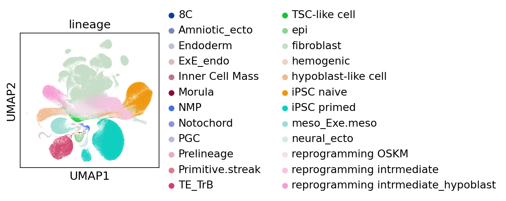

# Public Resources: Integrated Human Embryonic Reference Atlas & scPoli Model

We provide two complementary resources to support research on early human development and stem cell–derived embryo models. Both are freely available via Zenodo:  
🔗 **Download link:** https://doi.org/10.5281/zenodo.18607904

---

## 📦 Resource 1: Curated In Vivo Embryonic Reference Atlas

A harmonized single-cell RNA-seq atlas of **human in vivo embryonic development**, spanning pre-implantation through gastrulation stages (~day 5 to Carnegie stage 9).

### ✅ What you get
- Unified, quality-controlled count matrix (cells × genes) from **in vivo embryos only**
- Expert-curated cell type annotations based on canonical markers and original publications
- Batch-corrected expression values ready for downstream analysis

### 💡 Why use it?
- Serves as a gold-standard developmental reference for benchmarking embryo models (e.g., blastoids, assembloids)
- Enables cross-study comparisons of authentic human embryogenesis without reprocessing raw data
- Captures lineage trajectories across trophectoderm, epiblast, primitive endoderm/hypoblast, and gastrulating lineages

> ⚠️ **Note:** This resource contains **only in vivo embryonic datasets**—no in vitro models or reprogramming studies.

---

## 🤖 Resource 2: Pretrained scPoli Integration Model

A label-guided scPoli model trained on an **integrated dataset** combining:
- The in vivo embryonic reference atlas (Resource 1)
- **Plus** in vitro hypoblast-reprogramming and differentiation studies

This enables mapping of stem cell–derived models into the authentic embryonic continuum.

### ✅ What you get
- Saved scPoli model object (compatible with `scpoli`/`scarches` Python packages)
- Joint latent embedding space aligning in vitro hypoblast models with in vivo developmental trajectories
- Cell type classifier trained on expert annotations spanning both data types

### 💡 Why use it?
- **Map novel samples** (e.g., stem cell–derived hypoblasts) into the embryonic reference space without retraining
- **Quantify developmental fidelity** by measuring proximity of in vitro models to in vivo counterparts
- **Predict lineage identity** of uncharacterized populations using the joint classifier
- Supports zero-shot query integration via scArches-style fine-tuning

---

## 🧬 Source Datasets

### In Vivo Embryonic Datasets (used in **both** resources)

#### Pre-implantation Embryos
| Study | Year | Accession | Source |
|-------|------|-----------|--------|
| Petropoulos et al. | 2016 | E-MTAB-3929 | *Nature* |
| Yan et al. | 2013 | GSE36552 | *Nature Structural & Molecular Biology* |
| Yanagida et al. | 2021 | GSE171820 | *Cell Stem Cell* |
| Xue et al. | 2013 | GSE44183 | *Nature* |

#### Post-implantation to Gastrulation Embryos
| Study | Year | Accession | Source |
|-------|------|-----------|--------|
| Zhou et al. | 2019 | GSE109555 | *Nature* |
| Xiang et al. | 2020 | GSE136447 | *Cell Research* |
| Molè et al. | 2021 | E-MTAB-8060 | *Nature Communications* |
| Ai et al. | 2023 | PRJCA017779 | *Cell Research* |
| Tyser et al. | 2021 | E-MTAB-9388 | *Nature* |
| Zeng et al. | 2023 | GSE155121 | *Cell* |
| Yuan et al. | 2025 | HRA010231 | *Cell Stem Cell* |

### In Vitro Hypoblast-Reprogramming Studies (**model training only**)
| Study | Year | Accession | Source |
|-------|------|-----------|--------|
| Xing et al. | 2020 | GSE118258 | *Cell Stem Cell* |
| Nair et al. | 2023 | GSE242424 | *bioRxiv* |
| Liu et al. | 2020 | GSE150311 / GSE150637 / GSE147564 | *Nature* |

> 🔑 **Key distinction:** In vitro datasets were used **only for training the scPoli model** (Resource 2), not included in the standalone reference atlas (Resource 1).

---

## 🔬 Integration Workflow

1. **Reference atlas construction:** Curated and harmonized 11 in vivo embryonic datasets into a unified atlas (Resource 1).
2. **Extended integration:** Merged the in vivo atlas with 5 in vitro hypoblast-reprogramming datasets.
3. **Annotation:** Manually curated cell type labels using lineage-specific markers and publication metadata.
4. **Model training:** Trained scPoli with label guidance to learn a joint embedding that aligns in vitro models with in vivo developmental trajectories (Resource 2).

---

## 📊 Key Results

### Dataset Integration (scPoli model)
  
*Figure 1: UMAP visualization of the integrated embedding colored by original dataset source.*

### Developmental Continuum and Lineage Alignment
  
*Figure 2: UMAP visualization colored by cell lineages. The "ExE_endo" population represents hypoblast and its extraembryonic endoderm derivatives.*
---

## ⚙️ Model Specifications

| Parameter | Value |
|----------|-------|
| Framework | scPoli (label-guided variational autoencoder) |
| Training data | In vivo embryos + in vitro hypoblast models |
| Input features | Top 2,000 highly variable genes |
| Latent dimensions | 50 |
| Training labels | Expert-curated cell types across lineages |
| Compatibility | `scpoli`/`scarches` (Python); supports query integration |

---

## ℹ️ Usage Guidance

| Use case | Recommended resource |
|----------|----------------------|
| Study authentic human embryogenesis | **Resource 1** (in vivo atlas only) |
| Benchmark stem cell–derived hypoblast models | **Resource 2** (scPoli model) |
| Map new query data into developmental space | **Resource 2** (`model.query_integrate()`) |
| Differential expression on pure embryonic data | **Resource 1** |

> 💡 **Quick start:** Load the scPoli model with `scpoli.load_model()`, then map your query dataset using `model.query_integrate()`. The model returns developmental positioning and cell type predictions relative to the in vivo reference.

> 📌 **Citation:** Please reference our associated manuscript (in revision) and the Zenodo DOI: https://doi.org/10.5281/zenodo.18607904